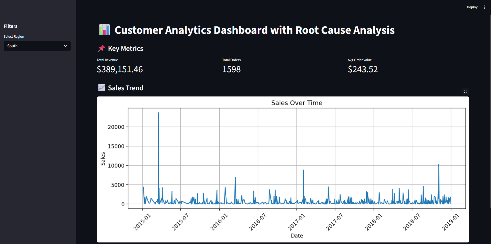

# 📊 Customer Analytics Dashboard with Root Cause Analysis

A data-driven analytics system that monitors key business metrics, detects performance drops, and identifies root causes to support data-driven decision-making.

---

## 🚀 Features

* 📌 KPI tracking (Revenue, Orders, Average Order Value)
* 🎛 Region-based filtering for focused analysis
* 📈 Sales trend visualization over time
* 🔍 Root cause analysis for performance drops
* 💡 Actionable recommendations based on insights

---

## 💡 Key Insight

This system goes beyond traditional dashboards by not only visualizing data but also identifying the underlying causes of performance changes, simulating real-world analytics and product support workflows.

---

## 🛠 Tech Stack

* Python
* SQL
* Streamlit
* Pandas
* Matplotlib

---

## 📸 Dashboard Preview

*(Add a screenshot here after running the app)*

Example:


---

## ▶️ How to Run Locally

```bash
pip install -r requirements.txt
python -m streamlit run app.py
```

---

## 📂 Project Structure

```
customer-analytics-dashboard/
│
├── app.py                  # Main dashboard (UI)
├── data/
│   └── ecommerce.csv      # Dataset
├── utils/
│   └── analysis.py        # Root cause logic
├── sql/
│   └── queries.sql        # Analytical SQL queries
├── requirements.txt
└── README.md
```

---

## 📊 Use Case

This project helps businesses:

* Monitor key performance indicators
* Identify sudden drops in revenue or engagement
* Analyze contributing factors (category, region)
* Take data-driven actions to improve performance

---

## 🎯 Future Improvements

* 🚨 Automated alert system for anomalies
* 🤖 Machine learning-based anomaly detection
* 🌐 Deployment for public access
* 📊 Advanced visualizations and UI enhancements


